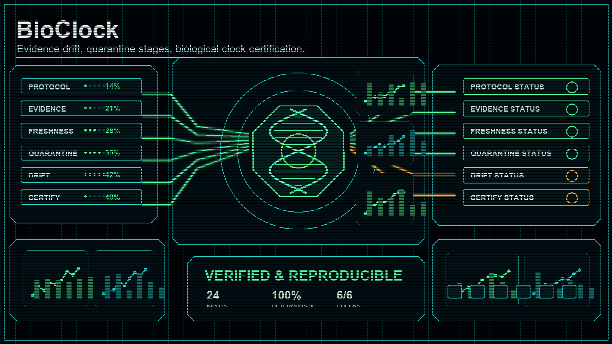

# BioClock

> Bio / medical verification layer — certify a biological clock from clinical evidence drift and quarantine staging.

## One-sentence pitch

`BioClock` answers: *Can a bio protocol prove that its evidence has not drifted and that the organism cleared quarantine before its biological clock is trusted?*

## Why this matters

Clinical and bio pipelines accumulate drift: observed effect sizes slide away from targets, sample counts fall short, and data goes stale. A biological clock cannot be certified while the evidence behind it is drifting or while quarantine stages are still open.

`BioClock` is a stdlib-only CLI and Python package for that certification boundary. It recombines three concerns:

- **DriftDossier** — clinical evidence drift tracking
- **Qvidence** — bio data pipeline health (freshness, sample sufficiency)
- **LazarettoStage** — biological quarantine staging

## What it is not

- Not a clinical trial management system.
- Not an EHR or PHI store.
- Not a live biosensor or wet-lab controller.
- Not a regulatory submission engine.

It computes a deterministic drift report and a deterministic certification verdict.

## Install / Run

Requires Python 3.10+ and no external packages.

From this project root:

```bash
python -m pip install -e .
python -m BioClock sample --out examples
python -m BioClock track --protocol examples/valid_protocol.json --evidence examples/valid_evidence.json
python -m BioClock certify --drift drift.json --quarantine examples/valid_quarantine.json
python -m BioClock report --input drift.json
```

A full valid run (sample -> track -> certify -> report):

```bash
python -m BioClock track \
  --protocol examples/valid_protocol.json \
  --evidence examples/valid_evidence.json \
  --out examples/valid_drift.json

python -m BioClock certify \
  --drift examples/valid_drift.json \
  --quarantine examples/valid_quarantine.json \
  --out examples/valid.cert.json

python -m BioClock report --input examples/valid.cert.json
```

## Drift scheme

- `none` — drift_magnitude < 0.1
- `moderate` — 0.1 <= drift_magnitude < 0.3
- `severe` — drift_magnitude >= 0.3

## Certification scheme

- `certified` — drift_severity is `none` and every quarantine stage passed observation.
- `conditional` — drift_severity is `moderate`.
- `revoked` — otherwise (severe drift, or quarantine not fully passed).

## Python API

```python
from BioClock import track_drift, certify_bio_clock, render_report

protocol = {"endpoint": "EFFICACY-01", "target_effect_size": 0.5, "required_samples": 120}
evidence = {"observed_effect_size": 0.48, "actual_samples": 120, "data_freshness_days": 3}

drift_report = track_drift(protocol, evidence)
print(drift_report["drift_severity"])  # "none"

quarantine = {
    "organism_id": "ORG-1",
    "stages": [{"name": "observe", "duration_days": 14, "observation_passed": True}],
}
cert = certify_bio_clock(drift_report, quarantine)
print(cert["certification"])  # "certified"

print(render_report(cert))
```

## Tests

From this project root:

```bash
python -m unittest discover -s tests -q
```

## License

MIT License — see [LICENSE](LICENSE).
